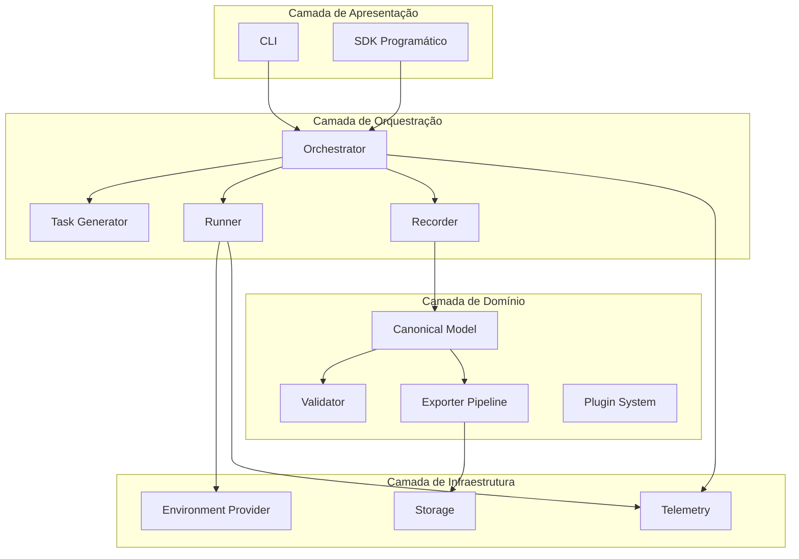
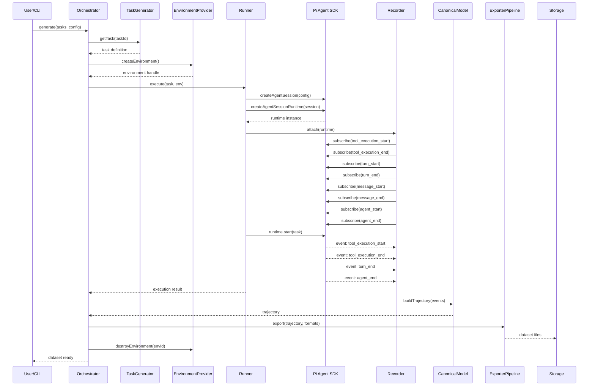
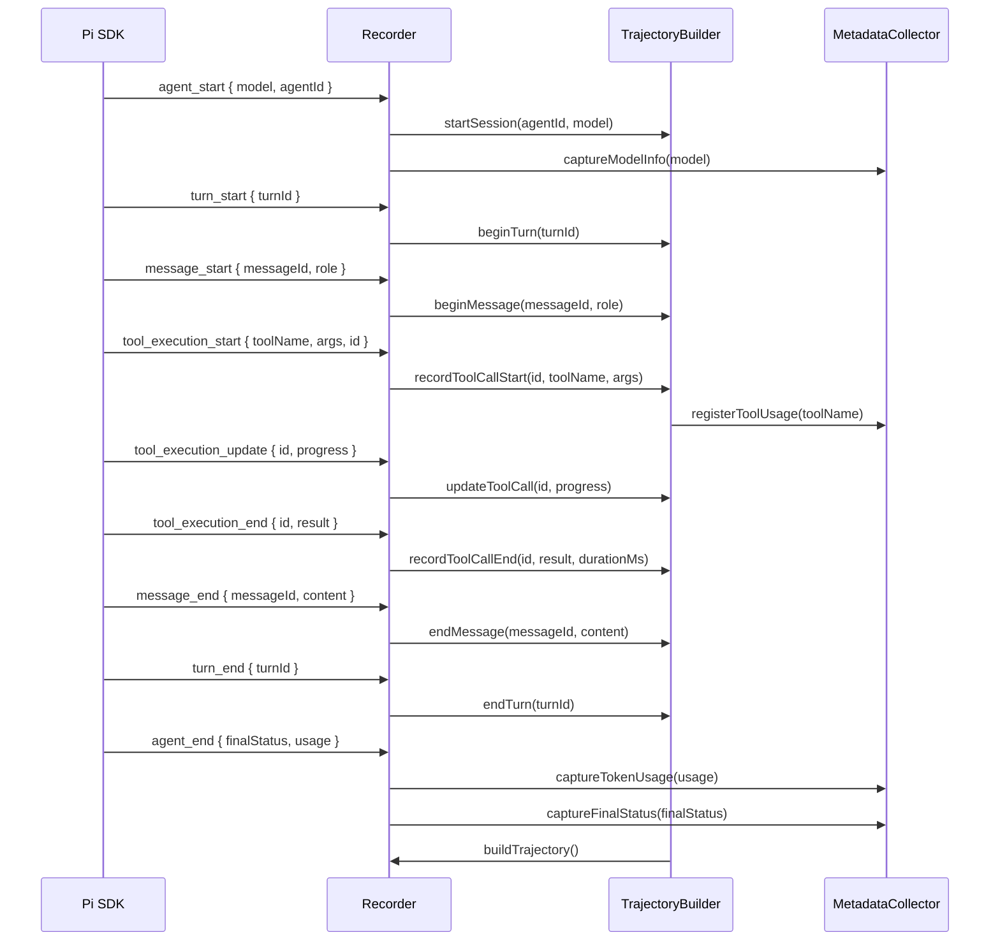
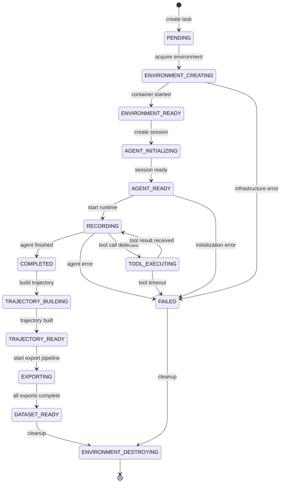
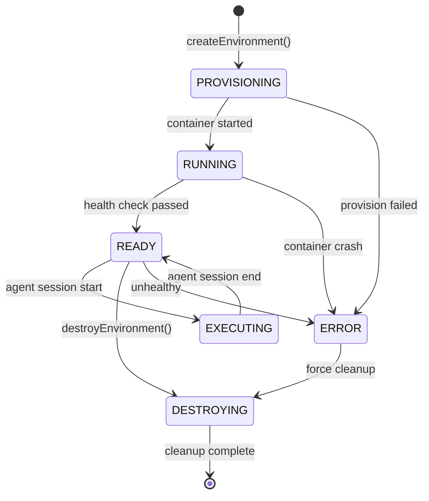
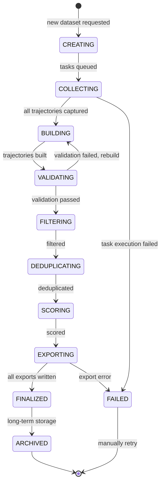
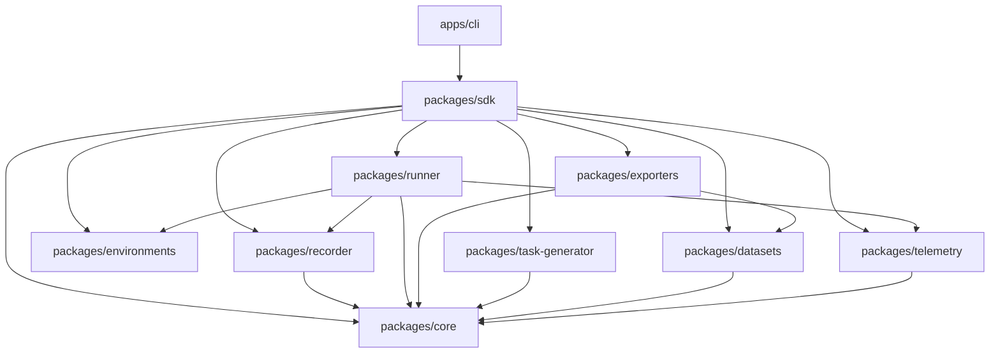
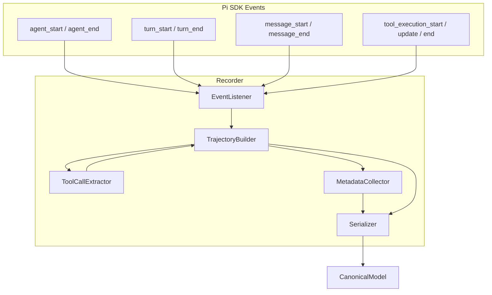
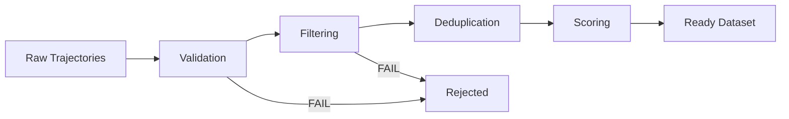

# OpenDistil — Plan de Arquitetura e Implementação

> **Versão:** 0.1.0-draft
> **Data:** Junho 2026
> **Status:** Planejamento — Pré-implementação

---

## Índice

1. [Missão, Visão e Objetivos](#1-missão-visão-e-objetivos)
2. [Princípios de Design](#2-princípios-de-design)
3. [Arquitetura de Alto Nível](#3-arquitetura-de-alto-nível)
4. [Diagrama de Componentes](#4-diagrama-de-componentes)
5. [Fluxo de Dados](#5-fluxo-de-dados)
6. [Fluxo de Eventos](#6-fluxo-de-eventos)
7. [Ciclo de Vida da Execução](#7-ciclo-de-vida-da-execução)
8. [Ciclo de Vida do Ambiente](#8-ciclo-de-vida-do-ambiente)
9. [Ciclo de Vida do Dataset](#9-ciclo-de-vida-do-dataset)
10. [Pipeline de Exportação](#10-pipeline-de-exportação)
11. [Sistema de Plugins](#11-sistema-de-plugins)
12. [Estrutura do Monorepo](#12-estrutura-do-monorepo)
13. [Pacotes Core](#13-pacotes-core)
14. [Design do Recorder](#14-design-do-recorder)
15. [Sistema de Ambientes](#15-sistema-de-ambientes)
16. [Geração de Tarefas](#16-geração-de-tarefas)
17. [Qualidade dos Datasets](#17-qualidade-dos-datasets)
18. [Metadados](#18-metadados)
19. [Design da CLI](#19-design-da-cli)
20. [Armazenamento](#20-armazenamento)
21. [Roadmap](#21-roadmap)
22. [Estratégia Open Source](#22-estratégia-open-source)
23. [Análise de Riscos](#23-análise-de-riscos)
24. [Visão de Longo Prazo](#24-visão-de-longo-prazo)

---

## 1. Missão, Visão e Objetivos

### Missão

Democratizar a geração de datasets de alta qualidade para treinamento de agentes de IA com capacidade de tool calling, fornecendo uma plataforma open-source que capture trajetórias completas de execução em ambientes isolados e reproduzíveis.

### Visão

Tornar-se a camada padrão da indústria para coleta, transformação e exportação de trajetórias de agentes — o equivalente ao que Hugging Face Datasets é para datasets estáticos, mas para trajetórias dinâmicas de agentes.

### Objetivos Estratégicos

| ID | Objetivo | Prioridade |
|---|---|---|
| O1 | Capturar trajetórias completas de agentes com fidelidade total a eventos | P0 |
| O2 | Isolar execuções em ambientes reprodutíveis (Podman first) | P0 |
| O3 | Exportar datasets nos formatos OpenAI, Anthropic, JSONL e ShareGPT | P0 |
| O4 | Suportar branching e múltiplas trajetórias para uma mesma tarefa | P1 |
| O5 | Permitir geração de datasets sintéticos com ferramentas customizadas | P1 |
| O6 | Fornecer CLI intuitiva e SDK programático | P0 |
| O7 | Construir ecossistema de plugins para exportadores e providers | P1 |
| O8 | Integrar com pipelines de RLHF/DPO/PRM | P2 |

### Não-Objetivos

- **Não** é um framework de agentes — usamos agentes existentes (Pi, outros).
- **Não** é um runtime de LLM — não substitui OpenAI, Anthropic, etc.
- **Não** é um sistema de produção para agentes — é uma ferramenta de geração de datasets.
- **Não** é um armazenamento de longo prazo — datasets são exportados para formatos padrão.
- **Não** é um sistema de orquestração de containers genérico — o isolamento é específico para execução de agentes.

---

## 2. Princípios de Design

### 2.1 Fidelidade de Dados

Toda informação disponível nos eventos do agente DEVE ser preservada na representação canônica interna. Perda de informação é inaceitável.

### 2.2 Separação entre Captura e Representação

O formato interno (canônico) é rico e completo. Formatos de exportação são derivados e podem perder informação. A transformação é sempre uma projeção do canônico.

### 2.3 Agnostismo de Provedor

Ambientes são plugáveis via `EnvironmentProvider`. O core do sistema não depende de Podman, Docker ou qualquer tecnologia específica de container.

### 2.4 Respeito à Origem dos Dados

Metadados de proveniência (modelo, ambiente, versão do agente, timestamp) são campos de primeira classe, não anexos.

### 2.5 Reprodutibilidade

Uma mesma tarefa no mesmo ambiente com o mesmo agente deve produzir a mesma sequência de eventos (dentro dos limites determinísticos do modelo).

### 2.6 Extensibilidade

Exportadores, providers de ambiente e geradores de tarefas são plugáveis via interfaces bem definidas. Nenhum componente central deve conhecer implementações concretas.

### 2.7 Privacidade por Design

O sistema nunca envia dados para serviços externos. Toda computação ocorre localmente.

---

## 3. Arquitetura de Alto Nível

### 3.1 Visão Geral em Camadas



### 3.2 Modelo Canônico de Trajetória

```typescript
// === Tipos Core do Modelo Canônico ===

interface ToolDefinition {
  name: string;
  description: string;
  inputSchema: Record<string, unknown>;
}

interface ToolCall {
  id: string;
  toolName: string;
  arguments: Record<string, unknown>;
  startTime: string;        // ISO 8601
  endTime: string;          // ISO 8601
  durationMs: number;
  result: unknown;
  error: string | null;
  status: "success" | "error" | "timeout";
}

interface Message {
  id: string;
  role: "user" | "assistant" | "system" | "tool_result";
  content: string | null;
  toolCalls: ToolCall[];
  timestamp: string;        // ISO 8601
  metadata: Record<string, unknown>;
}

interface Turn {
  id: string;
  index: number;
  userMessage: Message;
  assistantMessage: Message;
  toolResults: ToolCall[];
  startTime: string;
  endTime: string;
  durationMs: number;
}

interface ExecutionStep {
  type: "thinking" | "tool_execution" | "message" | "turn";
  data: unknown;
  timestamp: string;
}

interface TrajectoryMetadata {
  taskId: string;
  taskDescription: string;
  modelId: string;
  modelProvider: string;
  reasoningLevel: string;
  environmentId: string;
  environmentType: string;
  toolsAvailable: ToolDefinition[];
  toolsUsed: string[];
  totalTokens: number;
  promptTokens: number;
  completionTokens: number;
  totalDurationMs: number;
  turnCount: number;
  toolCallCount: number;
  successRate: number;
  finalStatus: "success" | "failure" | "timeout" | "error";
  repositoryUrl: string | null;
  taskCategory: string | null;
  timestamp: string;
  agentVersion: string;
  frameworkVersion: string;
  parentTrajectoryId: string | null;
  branchLabel: string | null;
}

interface Trajectory {
  metadata: TrajectoryMetadata;
  turns: Turn[];
  messages: Message[];
  steps: ExecutionStep[];
  rawEvents: unknown[];
  tags: string[];
  score: number | null;
}

interface DatasetRecord {
  trajectory: Trajectory;
  derivedFormats: {
    openai: unknown | null;
    anthropic: unknown | null;
    sharegpt: unknown | null;
    jsonl: unknown | null;
  };
}

interface Dataset {
  id: string;
  name: string;
  description: string;
  version: string;
  records: DatasetRecord[];
  createdAt: string;
  metadata: Record<string, unknown>;
}
```

---

## 4. Diagrama de Componentes

```mermaid
graph TB
    subgraph "apps/cli"
        CLI[CLI Entry Point]
        CMDS[Command Handlers]
    end

    subgraph "packages/core"
        CM[Canonical Model]
        IF[Interfaces]
        TYPES[Type Definitions]
        VALID[Validation]
    end

    subgraph "packages/recorder"
        REC[Recorder]
        EVL[Event Listener]
        TRB[Trajectory Builder]
        TCX[Tool Call Extractor]
        SER[Serializer]
        META[Metadata Collector]
    end

    subgraph "packages/runner"
        RUN[Runner]
        SESS[Session Manager]
        EXEC[Execution Controller]
    end

    subgraph "packages/environments"
        EPROV[EnvironmentProvider Interface]
        POD[PodmanProvider]
        DOCK[DockerProvider]
        LOC[LocalProvider]
        FACT[ProviderFactory]
    end

    subgraph "packages/exporters"
        EXP[Exporter Interface]
        OAI[OpenAIExporter]
        ANT[AnthropicExporter]
        SGPT[ShareGPTExporter]
        JSN[GenericJSONLExporter]
    end

    subgraph "packages/task-generator"
        TG[TaskGenerator]
        TG_MAN[ManualTaskGen]
        TG_AI[AITaskGen]
        TG_BENCH[BenchmarkTaskGen]
        TG_REPO[RepoBasedTaskGen]
    end

    subgraph "packages/datasets"
        DS[Dataset Manager]
        DS_VAL[Dataset Validator]
        DS_DEDUP[Deduplicator]
        DS_SCORE[Scorer]
        DS_FILT[Filter]
    end

    subgraph "packages/telemetry"
        TEL[Metrics Collector]
        TEL_ST[Statistics]
        TEL_LOG[Event Logger]
    end

    subgraph "packages/sdk"
        SDK[Public SDK]
        SDK_ORC[Orchestrator]
    end

    CLI --> SDK
    SDK --> REC
    SDK --> RUN
    SDK --> DS
    RUN --> EPROV
    REC --> CM
    RUN --> REC
    REC --> TEL
    DS --> EXP
    SDK --> TG
    EPROV --> POD
    EPROV --> DOCK
    EPROV --> LOC
```



---

## 5. Fluxo de Dados



---

## 6. Fluxo de Eventos

### 6.1 Mapeamento Evento → Registro do Dataset

| Evento do Pi | Ação do Recorder | Campo Preenchido no Dataset |
|---|---|---|
| `agent_start` | Inicializa sessão de gravação | `metadata.agentVersion`, `metadata.modelId`, `metadata.timestamp` |
| `agent_end` | Finaliza sessão, computa métricas | `metadata.totalDurationMs`, `metadata.finalStatus`, `metadata.totalTokens` |
| `turn_start` | Cria novo Turn | `turns[n].startTime`, `turns[n].index` |
| `turn_end` | Finaliza Turn | `turns[n].endTime`, `turns[n].durationMs` |
| `message_start` | Inicia buffer de mensagem | `messages[n].timestamp` |
| `message_end` | Finaliza mensagem | `messages[n].content`, `messages[n].role` |
| `tool_execution_start` | Extrai argumentos, inicia timer | `toolCalls[n].arguments`, `toolCalls[n].startTime` |
| `tool_execution_update` | Atualiza progresso | `toolCalls[n].metadata.intermediateResults` |
| `tool_execution_end` | Captura resultado e duração | `toolCalls[n].result`, `toolCalls[n].durationMs`, `toolCalls[n].status` |

### 6.2 Diagrama de Sequência de Eventos



---

## 7. Ciclo de Vida da Execução



---

## 8. Ciclo de Vida do Ambiente



### 8.1 Contrato do EnvironmentProvider

```typescript
interface EnvironmentSpec {
  image: string;
  memoryLimit?: string;      // e.g., "4g"
  cpuLimit?: string;         // e.g., "2"
  envVars?: Record<string, string>;
  networkAccess: boolean;
  mountPoints?: Array<{
    hostPath: string;
    containerPath: string;
    readOnly: boolean;
  }>;
  timeoutMs: number;
}

interface Environment {
  id: string;
  spec: EnvironmentSpec;
  status: "provisioning" | "running" | "ready" | "error" | "destroyed";
  createdAt: string;
  metadata: Record<string, unknown>;
}

interface EnvironmentHealthCheck {
  status: "healthy" | "unhealthy";
  message?: string;
  lastCheck: string;
}

interface EnvironmentProvider {
  readonly name: string;
  readonly version: string;

  createEnvironment(spec: EnvironmentSpec): Promise<Environment>;
  getEnvironment(id: string): Promise<Environment | null>;
  listEnvironments(filter?: Record<string, unknown>): Promise<Environment[]>;
  healthCheck(id: string): Promise<EnvironmentHealthCheck>;
  destroyEnvironment(id: string): Promise<void>;
  cleanupStaleEnvironments(maxAgeMs: number): Promise<string[]>;
}
```

---

## 9. Ciclo de Vida do Dataset



---

## 10. Pipeline de Exportação

### 10.1 Interface do Exportador

```typescript
interface ExportContext {
  dataset: Dataset;
  options: Record<string, unknown>;
}

interface ExportResult {
  format: string;
  path: string;
  recordCount: number;
  sizeBytes: number;
  hash: string;
  timestamp: string;
}

interface Exporter {
  readonly name: string;
  readonly format: string;
  readonly mimeType: string;

  exportRecord(record: DatasetRecord, context: ExportContext): unknown;
  exportBatch(records: DatasetRecord[], context: ExportContext): Promise<ExportResult>;
  validate(result: ExportResult): boolean;
}
```

### 10.2 Formatos de Exportação

#### OpenAI Tool Call Format

```json
{
  "messages": [
    {
      "role": "system",
      "content": "You are a helpful assistant with access to tools."
    },
    {
      "role": "user",
      "content": "Calculate the sum of 42 and 58."
    },
    {
      "role": "assistant",
      "content": null,
      "tool_calls": [
        {
          "id": "call_abc123",
          "type": "function",
          "function": {
            "name": "calculator",
            "arguments": "{\"a\": 42, \"b\": 58, \"operation\": \"add\"}"
          }
        }
      ]
    },
    {
      "role": "tool",
      "tool_call_id": "call_abc123",
      "content": "100"
    },
    {
      "role": "assistant",
      "content": "The sum of 42 and 58 is 100."
    }
  ]
}
```

#### Anthropic Tool Use Format

```json
{
  "messages": [
    {
      "role": "user",
      "content": "Calculate the sum of 42 and 58."
    },
    {
      "role": "assistant",
      "content": [
        {
          "type": "text",
          "text": "Let me calculate that."
        },
        {
          "type": "tool_use",
          "id": "toolu_abc123",
          "name": "calculator",
          "input": {
            "a": 42,
            "b": 58,
            "operation": "add"
          }
        }
      ]
    },
    {
      "role": "user",
      "content": [
        {
          "type": "tool_result",
          "tool_use_id": "toolu_abc123",
          "content": "100"
        }
      ]
    },
    {
      "role": "assistant",
      "content": "The sum of 42 and 58 is 100."
    }
  ]
}
```

#### Generic JSONL (Canônico Simplificado)

```json
{
  "task": "Calculate the sum of 42 and 58.",
  "trajectory": [
    {
      "step": 1,
      "type": "tool_call",
      "tool": "calculator",
      "input": {"a": 42, "b": 58, "operation": "add"},
      "output": 100,
      "duration_ms": 234
    }
  ],
  "final_answer": "The sum of 42 and 58 is 100.",
  "metadata": {
    "model": "claude-sonnet-4-20250514",
    "total_duration_ms": 1234,
    "tools_used": ["calculator"],
    "status": "success"
  }
}
```

---

## 11. Sistema de Plugins

### 11.1 Arquitetura

```typescript
interface PluginManifest {
  name: string;
  version: string;
  description: string;
  author: string;
  type: "environment-provider" | "exporter" | "task-generator" | "validator" | "filter";
  hooks: PluginHook[];
}

interface PluginContext {
  logger: Logger;
  storage: Storage;
  config: Record<string, unknown>;
}

interface Plugin {
  manifest: PluginManifest;
  initialize(context: PluginContext): Promise<void>;
  shutdown(): Promise<void>;
  [hook: string]: unknown;
}
```

### 11.2 Pontos de Extensão

| Ponto de Extensão | Interface | Exemplos |
|---|---|---|
| Environment Provider | `EnvironmentProvider` | Podman, Docker, K8s, Local |
| Exporter | `Exporter` | OpenAI, Anthropic, ShareGPT, JSONL |
| Task Generator | `TaskGenerator` | Manual, AI, Benchmark, Repo |
| Validator | `DatasetValidator` | Schema, Consistency, Completeness |
| Filter | `TrajectoryFilter` | Dedup, Quality, Length |

---

## 12. Estrutura do Monorepo

```
opendistil/
├── .github/
│   ├── workflows/
│   │   ├── ci.yml
│   │   ├── release.yml
│   │   └── docs.yml
│   ├── ISSUE_TEMPLATE/
│   └── CONTRIBUTING.md
│
├── apps/
│   └── cli/
│       ├── src/
│       │   ├── commands/
│       │   │   ├── generate.ts
│       │   │   ├── export.ts
│       │   │   ├── validate.ts
│       │   │   ├── inspect.ts
│       │   │   ├── replay.ts
│       │   │   └── list.ts
│       │   ├── cli.ts
│       │   └── index.ts
│       ├── package.json
│       └── tsconfig.json
│
├── packages/
│   ├── core/
│   │   ├── src/
│   │   │   ├── types/
│   │   │   │   ├── trajectory.ts
│   │   │   │   ├── dataset.ts
│   │   │   │   ├── environment.ts
│   │   │   │   ├── events.ts
│   │   │   │   ├── plugin.ts
│   │   │   │   └── index.ts
│   │   │   ├── interfaces/
│   │   │   │   ├── IEnvironmentProvider.ts
│   │   │   │   ├── IExporter.ts
│   │   │   │   ├── IRecorder.ts
│   │   │   │   ├── ITaskGenerator.ts
│   │   │   │   └── index.ts
│   │   │   ├── validation/
│   │   │   │   ├── trajectoryValidator.ts
│   │   │   │   └── datasetValidator.ts
│   │   │   └── index.ts
│   │   ├── package.json
│   │   └── tsconfig.json
│   │
│   ├── recorder/
│   │   ├── src/
│   │   │   ├── recorder.ts
│   │   │   ├── eventListener.ts
│   │   │   ├── trajectoryBuilder.ts
│   │   │   ├── toolCallExtractor.ts
│   │   │   ├── metadataCollector.ts
│   │   │   ├── serializer.ts
│   │   │   └── index.ts
│   │   ├── __tests__/
│   │   ├── package.json
│   │   └── tsconfig.json
│   │
│   ├── runner/
│   │   ├── src/
│   │   │   ├── runner.ts
│   │   │   ├── sessionManager.ts
│   │   │   ├── executionController.ts
│   │   │   ├── taskExecutor.ts
│   │   │   └── index.ts
│   │   ├── __tests__/
│   │   ├── package.json
│   │   └── tsconfig.json
│   │
│   ├── environments/
│   │   ├── src/
│   │   │   ├── providers/
│   │   │   │   ├── podmanProvider.ts
│   │   │   │   ├── dockerProvider.ts
│   │   │   │   ├── localProvider.ts
│   │   │   │   └── index.ts
│   │   │   ├── factory.ts
│   │   │   ├── baseProvider.ts
│   │   │   └── index.ts
│   │   ├── __tests__/
│   │   ├── package.json
│   │   └── tsconfig.json
│   │
│   ├── exporters/
│   │   ├── src/
│   │   │   ├── exporters/
│   │   │   │   ├── openaiExporter.ts
│   │   │   │   ├── anthropicExporter.ts
│   │   │   │   ├── sharegptExporter.ts
│   │   │   │   └── genericJsonlExporter.ts
│   │   │   ├── pipeline.ts
│   │   │   ├── registry.ts
│   │   │   └── index.ts
│   │   ├── __tests__/
│   │   ├── package.json
│   │   └── tsconfig.json
│   │
│   ├── task-generator/
│   │   ├── src/
│   │   │   ├── generators/
│   │   │   │   ├── manualTaskGenerator.ts
│   │   │   │   ├── aiTaskGenerator.ts
│   │   │   │   ├── benchmarkTaskGenerator.ts
│   │   │   │   └── repoTaskGenerator.ts
│   │   │   ├── registry.ts
│   │   │   └── index.ts
│   │   ├── __tests__/
│   │   ├── package.json
│   │   └── tsconfig.json
│   │
│   ├── datasets/
│   │   ├── src/
│   │   │   ├── datasetManager.ts
│   │   │   ├── validator.ts
│   │   │   ├── deduplicator.ts
│   │   │   ├── scorer.ts
│   │   │   ├── filter.ts
│   │   │   └── index.ts
│   │   ├── __tests__/
│   │   ├── package.json
│   │   └── tsconfig.json
│   │
│   ├── sdk/
│   │   ├── src/
│   │   │   ├── orchestrator.ts
│   │   │   ├── openDistil.ts
│   │   │   └── index.ts
│   │   ├── __tests__/
│   │   ├── package.json
│   │   └── tsconfig.json
│   │
│   └── telemetry/
│       ├── src/
│       │   ├── metricsCollector.ts
│       │   ├── statistics.ts
│       │   ├── eventLogger.ts
│       │   └── index.ts
│       ├── package.json
│       └── tsconfig.json
│
├── examples/
│   ├── basic-generation/
│   ├── custom-tools/
│   ├── custom-exporter/
│   └── branching/
│
├── docs/
│   ├── getting-started.md
│   ├── architecture.md
│   ├── recorder-design.md
│   ├── environment-providers.md
│   ├── exporters.md
│   ├── task-generators.md
│   ├── dataset-quality.md
│   ├── cli-reference.md
│   ├── plugin-development.md
│   └── contributing.md
│
├── scripts/
│   ├── bootstrap.sh
│   ├── lint.sh
│   └── release.sh
│
├── package.json                          # Root workspace config
├── tsconfig.base.json                    # Shared TS config
├── turbo.json                            # Turborepo config
├── .eslintrc.cjs
├── .prettierrc
├── .gitignore
├── LICENSE
├── README.md
├── CONTRIBUTING.md
├── CODE_OF_CONDUCT.md
└── PLAN.md
```

---

## 13. Pacotes Core

### 13.1 Tabela de Responsabilidades

| Pacote | Responsabilidade | Dependências | Público Alvo |
|---|---|---|---|
| `core` | Tipos, interfaces, validação do modelo canônico | Nenhuma (zero-dependency) | Todos os pacotes |
| `recorder` | Captura de eventos, reconstrução de trajetórias, extração de tool calls | `core`, `@earendil-works/pi-coding-agent` | SDK, CLI |
| `runner` | Gerenciamento de sessões do Pi, execução controlada | `core`, `recorder`, `environments` | SDK, CLI |
| `environments` | Providers de ambiente (Podman, Docker, Local) | `core` | SDK, CLI, Runner |
| `exporters` | Pipeline de exportação multi-formato | `core`, `datasets` | SDK, CLI |
| `task-generator` | Geração e gerenciamento de tarefas | `core` | SDK, CLI |
| `datasets` | Gerência, validação, dedup, scoring de datasets | `core` | SDK, CLI, Exporters |
| `sdk` | API pública, orchestrator, orquestração de ponta-a-ponta | `core`, `recorder`, `runner`, `environments`, `exporters`, `task-generator`, `datasets` | CLI, usuários finais |
| `telemetry` | Métricas, estatísticas, logging de eventos | `core` | SDK, CLI, Runner, Recorder |

### 13.2 Mapa de Dependências



---

## 14. Design do Recorder

### 14.1 Arquitetura Interna



### 14.2 Implementação Detalhada do Recorder

```typescript
import {
  AgentSession,
  AgentSessionRuntime,
  AgentEvent,
  ToolExecutionStartEvent,
  ToolExecutionUpdateEvent,
  ToolExecutionEndEvent,
  TurnStartEvent,
  TurnEndEvent,
  MessageStartEvent,
  MessageEndEvent,
  AgentStartEvent,
  AgentEndEvent,
} from "@earendil-works/pi-coding-agent";

interface RecorderConfig {
  captureRawEvents: boolean;
  captureIntermediateSteps: boolean;
  maxToolCallDurationMs: number;
}

class Recorder {
  private trajectoryBuilder: TrajectoryBuilder;
  private metadataCollector: MetadataCollector;
  private toolCallExtractor: ToolCallExtractor;
  private config: RecorderConfig;

  constructor(config?: Partial<RecorderConfig>) {
    this.config = {
      captureRawEvents: true,
      captureIntermediateSteps: true,
      maxToolCallDurationMs: 300_000, // 5 minutes
      ...config,
    };
    this.trajectoryBuilder = new TrajectoryBuilder();
    this.metadataCollector = new MetadataCollector();
    this.toolCallExtractor = new ToolCallExtractor();
  }

  attach(runtime: AgentSessionRuntime): void {
    const unsubscribeFns: Array<() => void> = [];

    // Agent lifecycle
    unsubscribeFns.push(
      runtime.on("agent_start", (event: AgentStartEvent) => {
        this.metadataCollector.captureAgentStart(event);
        this.trajectoryBuilder.startSession(event);
      })
    );

    unsubscribeFns.push(
      runtime.on("agent_end", (event: AgentEndEvent) => {
        this.metadataCollector.captureAgentEnd(event);
        this.trajectoryBuilder.endSession(event);
      })
    );

    // Turn lifecycle
    unsubscribeFns.push(
      runtime.on("turn_start", (event: TurnStartEvent) => {
        this.trajectoryBuilder.beginTurn(event);
      })
    );

    unsubscribeFns.push(
      runtime.on("turn_end", (event: TurnEndEvent) => {
        this.trajectoryBuilder.endTurn(event);
      })
    );

    // Message lifecycle
    unsubscribeFns.push(
      runtime.on("message_start", (event: MessageStartEvent) => {
        this.trajectoryBuilder.beginMessage(event);
      })
    );

    unsubscribeFns.push(
      runtime.on("message_end", (event: MessageEndEvent) => {
        this.trajectoryBuilder.endMessage(event);
      })
    );

    // Tool execution lifecycle
    unsubscribeFns.push(
      runtime.on("tool_execution_start", (event: ToolExecutionStartEvent) => {
        const toolCall = this.toolCallExtractor.extractStart(event);
        this.trajectoryBuilder.recordToolCallStart(toolCall);
        this.metadataCollector.registerToolUsage(event.toolName);
      })
    );

    unsubscribeFns.push(
      runtime.on("tool_execution_update", (event: ToolExecutionUpdateEvent) => {
        if (this.config.captureIntermediateSteps) {
          this.trajectoryBuilder.updateToolCall(event);
        }
      })
    );

    unsubscribeFns.push(
      runtime.on("tool_execution_end", (event: ToolExecutionEndEvent) => {
        const toolCall = this.toolCallExtractor.extractEnd(event);
        this.trajectoryBuilder.recordToolCallEnd(toolCall);
      })
    );

    // Store unsubscribe functions for cleanup
    this.trajectoryBuilder.setUnsubscribeFns(unsubscribeFns);
  }

  detach(): void {
    this.trajectoryBuilder.cleanup();
  }

  async buildTrajectory(): Promise<Trajectory> {
    const trajectory = this.trajectoryBuilder.build();
    const metadata = this.metadataCollector.buildMetadata();
    return {
      ...trajectory,
      metadata: {
        ...trajectory.metadata,
        ...metadata,
      },
    };
  }
}
```

### 14.3 TrajectoryBuilder Detail

```typescript
class TrajectoryBuilder {
  private currentSession: SessionState | null = null;
  private currentTurn: TurnState | null = null;
  private currentMessage: MessageState | null = null;
  private pendingToolCalls: Map<string, ToolCallState> = new Map();
  private completedToolCalls: ToolCall[] = [];
  private unsubscribeFns: Array<() => void> = [];

  private events: unknown[] = [];
  private turns: Turn[] = [];
  private messages: Message[] = [];
  private steps: ExecutionStep[] = [];

  startSession(event: AgentStartEvent): void {
    this.currentSession = {
      agentId: event.agentId,
      startTime: event.timestamp,
      modelId: event.modelId,
    };
    this.events = [];
    this.turns = [];
    this.messages = [];
    this.steps = [];
    this.pendingToolCalls.clear();
    this.completedToolCalls = [];

    if (this.captureRawEvents) {
      this.events.push(event);
    }
  }

  beginTurn(event: TurnStartEvent): void {
    this.currentTurn = {
      id: event.turnId,
      index: event.turnIndex,
      startTime: event.timestamp,
    };
  }

  endTurn(event: TurnEndEvent): void {
    if (!this.currentTurn) return;

    const turn: Turn = {
      id: this.currentTurn.id,
      index: this.currentTurn.index,
      userMessage: this.currentTurn.userMessage!,
      assistantMessage: this.currentTurn.assistantMessage!,
      toolResults: this.completedToolCalls.filter(
        tc => tc.timestamp >= this.currentTurn!.startTime
      ),
      startTime: this.currentTurn.startTime,
      endTime: event.timestamp,
      durationMs: new Date(event.timestamp).getTime() -
                  new Date(this.currentTurn.startTime).getTime(),
    };

    this.turns.push(turn);
    this.steps.push({
      type: "turn",
      data: turn,
      timestamp: event.timestamp,
    });

    this.currentTurn = null;
  }

  recordToolCallStart(toolCall: ToolCallState): void {
    this.pendingToolCalls.set(toolCall.id, toolCall);
    this.steps.push({
      type: "tool_execution",
      data: { action: "start", toolCall },
      timestamp: toolCall.startTime,
    });
  }

  recordToolCallEnd(toolCall: ToolCall): void {
    this.pendingToolCalls.delete(toolCall.id);
    this.completedToolCalls.push(toolCall);
    this.steps.push({
      type: "tool_execution",
      data: { action: "end", toolCall },
      timestamp: toolCall.endTime,
    });
  }

  build(): Trajectory {
    return {
      metadata: {
        // filled by MetadataCollector
        taskId: "",
        taskDescription: "",
        modelId: "",
        // ...
      } as TrajectoryMetadata,
      turns: this.turns,
      messages: this.messages,
      steps: this.steps,
      rawEvents: this.events,
      tags: [],
      score: null,
    };
  }

  cleanup(): void {
    for (const fn of this.unsubscribeFns) {
      fn();
    }
    this.unsubscribeFns = [];
  }
}
```

### 14.4 ToolCallExtractor Detail

```typescript
class ToolCallExtractor {
  private toolCallTimers: Map<string, number> = new Map();

  extractStart(event: ToolExecutionStartEvent): ToolCallState {
    const now = Date.now();
    this.toolCallTimers.set(event.toolExecutionId, now);

    return {
      id: event.toolExecutionId,
      toolName: event.toolName,
      arguments: event.args,
      startTime: new Date(now).toISOString(),
      status: "running",
    };
  }

  extractEnd(event: ToolExecutionEndEvent): ToolCall {
    const startTime = this.toolCallTimers.get(event.toolExecutionId);
    const endTimestamp = Date.now();
    const durationMs = startTime ? endTimestamp - startTime : 0;
    this.toolCallTimers.delete(event.toolExecutionId);

    return {
      id: event.toolExecutionId,
      toolName: event.toolName,
      arguments: event.args ?? {},
      startTime: startTime
        ? new Date(startTime).toISOString()
        : new Date(endTimestamp).toISOString(),
      endTime: new Date(endTimestamp).toISOString(),
      durationMs,
      result: event.result,
      error: event.error ?? null,
      status: event.error ? "error" : "success",
    };
  }
}
```

---

## 15. Sistema de Ambientes

### 15.1 Implementação PodmanProvider

```typescript
import { execSync, spawn } from "child_process";
import { randomUUID } from "crypto";
import { writeFileSync, unlinkSync, existsSync, mkdirSync } from "fs";
import { join } from "path";

class PodmanProvider implements EnvironmentProvider {
  readonly name = "podman";
  readonly version = "1.0.0";
  private tempDir: string;

  constructor(tempDir?: string) {
    this.tempDir = tempDir ?? "/tmp/opendistil-environments";
    if (!existsSync(this.tempDir)) {
      mkdirSync(this.tempDir, { recursive: true });
    }
  }

  async createEnvironment(spec: EnvironmentSpec): Promise<Environment> {
    const id = `opendistil-${randomUUID().slice(0, 8)}`;

    const args = [
      "podman", "run", "-d",
      "--name", id,
      "--network", spec.networkAccess ? "bridge" : "none",
    ];

    if (spec.memoryLimit) args.push("--memory", spec.memoryLimit);
    if (spec.cpuLimit) args.push("--cpus", spec.cpuLimit);

    for (const [key, value] of Object.entries(spec.envVars ?? {})) {
      args.push("-e", `${key}=${value}`);
    }

    for (const mount of spec.mountPoints ?? []) {
      args.push(
        "-v",
        `${mount.hostPath}:${mount.containerPath}${mount.readOnly ? ":ro" : ""}`
      );
    }

    args.push(spec.image, "sleep", "infinity");

    execSync(args.join(" "), { stdio: "pipe" });

    return {
      id,
      spec,
      status: "running",
      createdAt: new Date().toISOString(),
      metadata: {
        provider: "podman",
        image: spec.image,
      },
    };
  }

  async destroyEnvironment(id: string): Promise<void> {
    execSync(`podman rm -f ${id}`, { stdio: "pipe" });
  }

  async getEnvironment(id: string): Promise<Environment | null> {
    try {
      const output = execSync(`podman inspect ${id}`, {
        encoding: "utf-8",
        stdio: "pipe",
      });
      const data = JSON.parse(output)[0];
      return {
        id,
        spec: {} as EnvironmentSpec,
        status: data.State.Status === "running" ? "running" : "error",
        createdAt: data.Created,
        metadata: data,
      };
    } catch {
      return null;
    }
  }

  async listEnvironments(): Promise<Environment[]> {
    const output = execSync(
      'podman ps -a --filter "name=opendistil-*" --format json',
      { encoding: "utf-8", stdio: "pipe" }
    );
    return JSON.parse(output || "[]").map((c: any) => ({
      id: c.Names[0],
      spec: {} as EnvironmentSpec,
      status: c.Status,
      createdAt: c.Created,
      metadata: c,
    }));
  }

  async healthCheck(id: string): Promise<EnvironmentHealthCheck> {
    try {
      execSync(`podman exec ${id} echo "ok"`, { stdio: "pipe" });
      return { status: "healthy", lastCheck: new Date().toISOString() };
    } catch {
      return {
        status: "unhealthy",
        message: "Container not responding",
        lastCheck: new Date().toISOString(),
      };
    }
  }

  async cleanupStaleEnvironments(maxAgeMs: number): Promise<string[]> {
    const envs = await this.listEnvironments();
    const now = Date.now();
    const stale: string[] = [];

    for (const env of envs) {
      const age = now - new Date(env.createdAt).getTime();
      if (age > maxAgeMs) {
        await this.destroyEnvironment(env.id);
        stale.push(env.id);
      }
    }

    return stale;
  }
}
```

### 15.2 ProviderFactory

```typescript
interface ProviderFactoryConfig {
  defaultProvider: string;
  podman?: { tempDir?: string };
  docker?: { tempDir?: string };
  local?: { workDir?: string };
}

class ProviderFactory {
  private providers: Map<string, EnvironmentProvider> = new Map();
  private config: ProviderFactoryConfig;

  constructor(config: ProviderFactoryConfig) {
    this.config = config;
  }

  register(name: string, provider: EnvironmentProvider): void {
    this.providers.set(name, provider);
  }

  getProvider(name?: string): EnvironmentProvider {
    const providerName = name ?? this.config.defaultProvider;
    const provider = this.providers.get(providerName);
    if (!provider) {
      throw new Error(`Environment provider "${providerName}" not registered`);
    }
    return provider;
  }

  static createDefault(config?: Partial<ProviderFactoryConfig>): ProviderFactory {
    const resolvedConfig: ProviderFactoryConfig = {
      defaultProvider: "podman",
      ...config,
    };

    const factory = new ProviderFactory(resolvedConfig);
    factory.register("podman", new PodmanProvider(resolvedConfig.podman?.tempDir));
    factory.register("docker", new DockerProvider(resolvedConfig.docker?.tempDir));
    factory.register("local", new LocalProvider(resolvedConfig.local?.workDir));

    return factory;
  }
}
```

---

## 16. Geração de Tarefas

### 16.1 Interface

```typescript
interface TaskDefinition {
  id: string;
  description: string;
  category: string;
  difficulty: "easy" | "medium" | "hard";
  toolsRequired: string[];
  expectedTools: string[];
  maxTurns: number;
  timeoutMs: number;
  tags: string[];
  repository?: {
    url: string;
    branch: string;
  };
  validation?: {
    criteria: string[];
    expectedOutput?: unknown;
  };
}

interface TaskGenerator {
  readonly name: string;
  generate(count: number, context?: Record<string, unknown>): Promise<TaskDefinition[]>;
  getTask(id: string): Promise<TaskDefinition | null>;
  listCategories(): Promise<string[]>;
}
```

### 16.2 Tipos de Geradores

| Gerador | Descrição | Caso de Uso |
|---|---|---|
| `ManualTaskGenerator` | Tarefas definidas manualmente em JSON/YAML | Datasets curados, validação |
| `AITaskGenerator` | Geração por LLM de tarefas sintéticas | Escala, diversidade |
| `BenchmarkTaskGenerator` | Tarefas de benchmarks existentes (GAIA, SWE-bench, etc.) | Avaliação comparativa |
| `RepoTaskGenerator` | Tarefas baseadas em issues de repositórios | Engenharia de software |

---

## 17. Qualidade dos Datasets

### 17.1 Pipeline de Qualidade



### 17.2 Validadores

| Validador | Descrição | Critério |
|---|---|---|
| `SchemaValidator` | Verifica estrutura do canônico | JSON Schema |
| `CompletenessValidator` | Verifica se todos os campos obrigatórios existem | Non-null checks |
| `ConsistencyValidator` | Timestamps coerentes, IDs sem quebra | Relacional |
| `ToolCallValidator` | Tool calls têm resultado correspondente | Correspondência 1:1 |
| `TimeoutValidator` | Nenhuma tool call excedeu timeout | `durationMs < maxToolCallDuration` |

### 17.3 Filtros

| Filtro | Descrição | Parâmetro |
|---|---|---|
| `LengthFilter` | Remove trajetórias muito curtas ou longas | `minTurns`, `maxTurns` |
| `StatusFilter` | Filtra por status final | `allowedStatuses: ["success"]` |
| `ToolFilter` | Filtra por ferramentas específicas | `requiredTools: ["calculator"]` |
| `DurationFilter` | Filtra por duração | `minDurationMs`, `maxDurationMs` |

### 17.4 Métricas de Qualidade

| Métrica | Definição | Faixa Ideal |
|---|---|---|
| `completionRate` | Proporção de tarefas concluídas com sucesso | > 0.8 |
| `toolCallSuccessRate` | Proporção de tool calls que retornaram sem erro | > 0.9 |
| `averageTurnsPerTask` | Número médio de turns | 3-15 |
| `averageToolCallsPerTask` | Número médio de tool calls | 2-20 |
| `averageDurationMs` | Duração média por trajetória | 10s-120s |
| `diversityScore` | Variedade de ferramentas utilizadas | > 0.5 |

---

## 18. Metadados

### 18.1 Schema de Metadados

```typescript
interface DatasetMetadata {
  // Proveniência
  id: string;
  name: string;
  description: string;
  version: string;
  createdAt: string;
  frameworkVersion: string;

  // Modelo
  model: {
    id: string;
    provider: string;
    reasoningLevel: string;
  };

  // Estatísticas
  statistics: {
    totalRecords: number;
    totalTurns: number;
    totalToolCalls: number;
    totalDurationMs: number;
    averageTurnsPerRecord: number;
    averageToolCallsPerRecord: number;
    averageDurationPerRecord: number;
    successRate: number;
    toolCallSuccessRate: number;
  };

  // Execução
  execution: {
    environmentType: string;
    environmentImage: string;
    totalTasks: number;
    failedTasks: number;
    timeoutTasks: number;
    startTime: string;
    endTime: string;
  };

  // Ferramentas
  tools: {
    available: ToolDefinition[];
    used: Array<{
      name: string;
      callCount: number;
      successCount: number;
      averageDurationMs: number;
    }>;
  };

  // Distribuição
  distribution: {
    byCategory: Record<string, number>;
    byDifficulty: Record<string, number>;
    byStatus: Record<string, number>;
    byToolCount: Record<string, number>;
  };

  // Tags
  tags: string[];
  taskCategories: string[];

  // Dataset lineage
  lineage: {
    parentDatasetId: string | null;
    derivedFrom: string | null;
    generationConfig: Record<string, unknown>;
  };
}
```

---

## 19. Design da CLI

### 19.1 Comandos

```bash
opendistil generate   # Gera um dataset executando tarefas em agentes
opendistil export     # Exporta um dataset para formatos específicos
opendistil validate   # Valida um dataset existente
opendistil inspect    # Inspeciona uma trajetória ou dataset
opendistil replay     # Replay de uma trajetória gravada
opendistil list       # Lista tarefas, datasets, ambientes
opendistil config     # Gerencia configuração
opendistil version    # Mostra versão
```

### 19.2 Especificação de Comandos

| Comando | Uso | Descrição |
|---|---|---|
| `generate` | `opendistil generate [--tasks <file>] [--model <id>] [--env podman\|docker\|local] [--output <dir>] [--max-concurrent <n>] [--timeout <ms>]` | Gera dataset executando tarefas em agente |
| `export` | `opendistil export <dataset> [--format openai\|anthropic\|sharegpt\|jsonl\|all] [--output <dir>] [--split train/val/test]` | Exporta dataset em formatos de treinamento |
| `validate` | `opendistil validate <dataset> [--strict] [--report <file>]` | Valida integridade do dataset |
| `inspect` | `opendistil inspect <dataset> [--trajectory <id>] [--json] [--stats]` | Inspeciona dataset ou trajetória |
| `replay` | `opendistil replay <dataset> <trajectory-id>` | Reapresenta trajetória no terminal |
| `list` | `opendistil list [tasks\|datasets\|environments] [--filter <key=value>]` | Lista recursos |
| `config` | `opendistil config [set\|get\|list] [<key> <value>]` | Gerencia configuração |
| `version` | `opendistil version` | Exibe versão |

### 19.3 Exemplos de Uso

```bash
# Geração básica
opendistil generate \
  --tasks ./tasks/math-problems.json \
  --env podman \
  --output ./datasets/math-v1

# Geração com configuração avançada
opendistil generate \
  --tasks ./tasks/swe-bench-lite.json \
  --model claude-sonnet-4-20250514 \
  --env docker \
  --max-concurrent 4 \
  --timeout 300000 \
  --output ./datasets/swe-bench-v1

# Exportação multi-formato
opendistil export ./datasets/math-v1 \
  --format all \
  --output ./datasets/math-v1/exported \
  --split train=0.8,val=0.1,test=0.1

# Validação
opendistil validate ./datasets/math-v1 --strict --report ./reports/math-v1.json

# Inspeção interativa
opendistil inspect ./datasets/math-v1 --stats

# Listar ambientes disponíveis
opendistil list environments
```

---

## 20. Armazenamento

### 20.1 Estratégia

| Camada | Tecnologia | Finalidade | Vantagens | Desvantagens |
|---|---|---|---|---|
| Runtime | JSONL | Saída principal dos datasets | Simples, streaming, universal | Sem índices, sem queries |
| Metadata | SQLite | Catálogo de datasets, trajetórias | Queries SQL, indexing, portátil | Não escala horizontalmente |
| Raw Events | File System (JSON) | Preservação de eventos brutos | Simples, debug | Ocupa espaço |
| Cache | File System (JSON) | Cache de execuções parciais | Resumibilidade | Gerenciamento manual |
| Distribuído (futuro) | S3 / GCS / R2 | Datasets versionados em larga escala | Escalável, compartilhável | Complexidade operacional |

### 20.2 Estrutura de Diretórios

```
~/.opendistil/
├── config.yaml                      # Configuração global
├── datasets/
│   ├── math-v1/
│   │   ├── dataset.json             # Metadados do dataset (SQLite export)
│   │   ├── dataset.db              # SQLite database
│   │   ├── trajectories/
│   │   │   ├── traj-001.json
│   │   │   ├── traj-002.json
│   │   │   └── ...
│   │   ├── raw/
│   │   │   ├── run-001-events.json
│   │   │   └── ...
│   │   └── exported/
│   │       ├── openai/
│   │       │   ├── train.jsonl
│   │       │   ├── val.jsonl
│   │       │   └── test.jsonl
│   │       ├── anthropic/
│   │       └── sharegpt/
│   └── ...
├── cache/
│   └── ...                          # Cache de execuções
└── logs/
    └── ...                          # Logs de execução
```

---

## 21. Roadmap

### 21.1 Fase 0 — Pesquisa (Semanas 1-3)

| Item | Descrição | Critério de Conclusão |
|---|---|---|
| Análise do SDK do Pi | Documentar todos os eventos, tipos e interfaces | Documento de análise aprovado |
| Prova de conceito do Recorder | Script que captura eventos e imprime JSON | 3 trajetórias capturadas com sucesso |
| Prova de conceito do Podman | Container executando agente Pi | Execução de agente dentro de container |
| Definição do modelo canônico | Tipos TypeScript validados | Schema compilado sem erros |
| Benchmark de formatos | Comparação OpenAI vs Anthropic vs JSONL | Tabela comparativa |

**Riscos:** SDK do Pi pode ter cobertura de eventos incompleta.
**Mitigação:** Contato direto com equipe do Pi, fallback para hooks manuais.

### 21.2 Fase 1 — MVP (Semanas 4-8)

**Objetivo:** Pipeline funcional de geração de datasets com Podman.

**Entregas:**

| Entrega | Pacote | Estimativa |
|---|---|---|
| Core types e interfaces | `core` | 1 semana |
| PodmanProvider funcional | `environments` | 1 semana |
| Recorder com eventos básicos | `recorder` | 2 semanas |
| Runner com suporte a Pi | `runner` | 1 semana |
| OpenAIExporter | `exporters` | 0.5 semana |
| CLI com `generate` e `export` | `apps/cli` | 1 semana |
| SDK orchestrator | `sdk` | 1 semana |
| Documentação inicial | `docs/` | 0.5 semana |

**Riscos:** Integração com Podman em diferentes distribuições Linux.
**Mitigação:** Testes em CI com GitHub Actions + Podman.

### 21.3 Fase 2 — Recorder Estável (Semanas 9-12)

**Objetivo:** Recorder robusto com cobertura total de eventos.

**Entregas:**

| Entrega | Descrição |
|---|---|
| Todos os eventos do Pi mapeados | Cobertura 100% dos eventos |
| ToolCallExtractor com timeouts | Detecção de tool calls órfãs |
| MetadataCollector completo | Tokens, timing, ambiente |
| Serializer resiliente | Tratamento de erros, retry |
| Dataset validator | Schema + consistência |
| Tests com mock do Pi | Cobertura > 90% |

**Critério de Conclusão:** 1000 trajetórias geradas sem perda de dados.

### 21.4 Fase 3 — Ecossistema de Datasets (Semanas 13-18)

**Objetivo:** Dataset management, qualidade, e exportação multi-formato.

**Entregas:**

| Entrega | Descrição |
|---|---|
| AnthropicExporter | Formato tool_use / tool_result |
| ShareGPTExporter | Formato ShareGPT compatível |
| GenericJSONLExporter | Formato extensível próprio |
| Deduplicator | Remoção de trajetórias duplicadas |
| Scorer | Scoring baseado em quality metrics |
| Filter pipeline | Filtros configuráveis |
| DockerProvider | Suporte a Docker |
| LocalProvider | Execução sem container (dev) |
| SQLite storage | Catálogo de datasets com queries |
| `inspect` e `validate` commands | CLI completa |

### 21.5 Fase 4 — Branching e Preferências (Semanas 19-24)

**Objetivo:** Suporte a múltiplas trajetórias por tarefa e datasets de preferência.

**Entregas:**

| Entrega | Descrição |
|---|---|
| Suporte a forks no Pi | Múltiplas execuções da mesma tarefa |
| Trajectory branching model | Árvore de trajetórias |
| Preference dataset format | Formato escolha/rejeitada |
| DPO dataset export | Export direto para DPO |
| PRM dataset export | Process Reward Model format |
| Trajectory ranking | Interface para ranking manual |

**Riscos:** SDK do Pi pode não expor API de forks.
**Mitigação:** Implementar branching no Runner, gerenciando múltiplas sessões.

### 21.6 Fase 5 — Execução Distribuída (Semanas 25-30)

**Objetivo:** Geração paralela em larga escala com múltiplos workers.

**Entregas:**

| Entrega | Descrição |
|---|---|
| KubernetesProvider | Execução em clusters K8s |
| Job queue | Redis/Bull-based job queue |
| Concurrent execution | Múltiplos agentes paralelos |
| Rate limiting | Controle de concorrência |
| Distributed cache | Cache compartilhado de execuções |
| Telemetry dashboard | Métricas em tempo real |

**Riscos:** Complexidade operacional do Kubernetes.
**Mitigação:** Provider K8s opcional, execução local sempre suportada.

### 21.7 Fase 6 — Plataforma de Pesquisa (Semanas 31-40)

**Objetivo:** OpenDistil como plataforma de pesquisa em trajetórias de agentes.

**Entregas:**

| Entrega | Descrição |
|---|---|
| AI Task Generator | Geração de tarefas por LLM |
| Repo-based tasks | Tarefas de issues do GitHub |
| Trajectory replay UI | Visualização interativa |
| Dataset comparison | Comparação entre datasets |
| Plugin SDK | Desenvolvimento de plugins de terceiros |
| Community registry | Registry de plugins e exporters |

---

## 22. Estratégia Open Source

### 22.1 Licenciamento

**Apache 2.0** (já estabelecido via `LICENSE`).

**Razões:**
- Permissivo para uso comercial e acadêmico
- Compatível com a maioria dos ecossistemas de IA/ML
- Proteção de patentes para contribuidores
- Amplamente adotado na comunidade JS/TS

### 22.2 Governança

| Papel | Responsabilidade |
|---|---|
| **Maintainers** | Revisão de PRs, releases, visão técnica |
| **Committers** | Acesso de commit, revisão de código |
| **Contributors** | Pull requests, issues, documentação |
| **Advisory Board** | Direção estratégica, parcerias |

**Processo:**
- Decisões por consenso entre maintainers
- RFCs para mudanças arquiteturais significativas
- Releases seminais versionadas (SemVer)
- LTS releases para estabilidade

### 22.3 Documentação

| Tipo | Formato | Público |
|---|---|---|
| Getting Started | Markdown + exemplos | Novos usuários |
| Architecture | PLAN.md + diagramas | Contribuidores |
| API Reference | TypeScript types + JSDoc | Desenvolvedores |
| CLI Reference | Markdown | Usuários da CLI |
| Plugin Dev Guide | Markdown + templates | Plugin developers |
| Contributing Guide | CONTRIBUTING.md | Todos |

### 22.4 Construção de Comunidade

- GitHub Discussions para suporte e ideias
- Discord/Slack para comunidade
- Issues templates para bugs e features
- `good first issue` label para novos contribuidores
- Monthly community calls (após Fase 2)
- GitHub Sponsors para sustentabilidade

---

## 23. Análise de Riscos

| Risco | Probabilidade | Impacto | Mitigação |
|---|---|---|---|
| SDK do Pi muda sem aviso | Média | Alto | Versão fixa do SDK, testes de compatibilidade em CI |
| SDK do Pi cobre eventos insuficientemente | Baixa | Alto | Fallback para polling + hooks manuais no Runner |
| Qualidade dos datasets gerados é baixa | Média | Médio | Pipeline de validação, filtros, scoring métrico |
| Ambientes container falham | Média | Alto | Health checks, retry, fallback para LocalProvider |
| Reprodutibilidade entre execuções | Alta | Médio | Seeds fixos, versionamento de imagens, lock de ambiente |
| Custo de armazenamento alto | Baixa | Baixo | Compressão, políticas de retenção, export sob demanda |
| Isolamento de segurança falha | Baixa | Crítico | Network none default, seccomp, rm -f pós-execução |
| Manutenção de longo prazo | Média | Alto | CI/CD, testes automatizados, LTS releases |

---

## 24. Visão de Longo Prazo

### 24.1 Plataforma de Geração de Datasets

O OpenDistil evolui para um hub de geração onde pesquisadores podem:
- Definir tarefas em linguagem natural
- Escolher modelos (Pi, OpenAI, Anthropic, open-source)
- Configurar ambientes customizados
- Gerar datasets em escala
- Publicar datasets para a comunidade

### 24.2 Framework de Benchmark de Agentes

- Catálogo de benchmarks padronizados
- Execução reprodutível de agentes em tarefas de benchmark
- Métricas comparativas entre modelos
- Leaderboard público de performance

### 24.3 Sistema de Avaliação

- Avaliação automática de trajetórias
- Recompensa baseada em critérios customizáveis
- Comparação entre trajetórias (preferência)
- Feedback loop para melhoria de agentes

### 24.4 Plataforma de Pesquisa em Trajetórias

- Análise de padrões de tool calling
- Identificação de estratégias de sucesso
- Estudo de comportamentos emergentes
- Visualização e exploração interativa

### 24.5 Plataforma para RL e Alinhamento

- Geração de datasets de preferência (DPO, RLHF)
- Process Reward Model datasets
- Trajetórias rankeadas para treinamento de reward models
- Feedback loop para fine-tuning de agentes

---

## Apêndice A: Glossário

| Termo | Definição |
|---|---|
| **Trajetória** | Sequência completa de eventos de uma execução de agente, incluindo mensagens, tool calls e resultados |
| **Turn** | Ciclo user→assistant→tool no diálogo agente |
| **Tool Call** | Invocação de uma ferramenta pelo agente, com argumentos e resultado |
| **Canonical Model** | Representação interna rica que preserva toda informação disponível |
| **Environment Provider** | Abstração para criação/destruição de ambientes isolados |
| **Dataset Record** | Uma trajetória + suas derivações de exportação |
| **Branching** | Múltiplas execuções da mesma tarefa para gerar trajetórias alternativas |
| **DPO** | Direct Preference Optimization — técnica de fine-tuning com preferências |
| **PRM** | Process Reward Model — modelo que pontua passos intermediários |

## Apêndice B: Configuração do Projeto

```jsonc
// package.json (root)
{
  "name": "opendistil",
  "private": true,
  "workspaces": [
    "apps/*",
    "packages/*"
  ],
  "scripts": {
    "build": "turbo run build",
    "test": "turbo run test",
    "lint": "turbo run lint",
    "typecheck": "turbo run typecheck",
    "clean": "turbo run clean",
    "format": "prettier --write .",
    "ci": "turbo run build test lint typecheck"
  },
  "devDependencies": {
    "turbo": "^2.0.0",
    "typescript": "^5.5.0",
    "prettier": "^3.0.0",
    "eslint": "^9.0.0",
    "@types/node": "^20.0.0",
    "vitest": "^2.0.0"
  },
  "packageManager": "pnpm@9.0.0",
  "engines": {
    "node": ">=20.0.0"
  }
}
```

```jsonc
// tsconfig.base.json
{
  "compilerOptions": {
    "target": "ES2022",
    "module": "ESNext",
    "moduleResolution": "bundler",
    "lib": ["ES2022"],
    "strict": true,
    "esModuleInterop": true,
    "skipLibCheck": true,
    "forceConsistentCasingInFileNames": true,
    "declaration": true,
    "declarationMap": true,
    "sourceMap": true,
    "outDir": "dist",
    "rootDir": "src",
    "resolveJsonModule": true
  }
}
```

## Apêndice C: Integração com Pi Coding Agent

```typescript
// Exemplo de uso da SDK do Pi com OpenDistil
import { createAgentSession, createAgentSessionRuntime } from "@earendil-works/pi-coding-agent";
import { OpenDistil } from "@opendistil/sdk";

const od = new OpenDistil({
  environmentProvider: "podman",
});

const dataset = await od.generate({
  tasks: [
    {
      id: "calc-001",
      description: "Calculate the compound interest on $1000 at 5% for 3 years",
      toolsRequired: ["calculator"],
    },
  ],
  agent: {
    type: "pi",
    config: {
      model: "claude-sonnet-4-20250514",
      tools: [
        {
          name: "calculator",
          description: "Performs arithmetic calculations",
          inputSchema: {
            type: "object",
            properties: {
              a: { type: "number" },
              b: { type: "number" },
              operation: { type: "string", enum: ["add", "subtract", "multiply", "divide"] },
            },
          },
        },
      ],
    },
  },
  outputDir: "./datasets/calc-v1",
});

console.log(`Generated ${dataset.records.length} trajectories`);

// Export for OpenAI fine-tuning
await od.export(dataset.id, {
  formats: ["openai"],
  outputDir: "./datasets/calc-v1/exported",
  split: { train: 0.8, val: 0.1, test: 0.1 },
});
```

---

> Este documento é um plano vivo e será atualizado conforme o projeto evolui.
> Proposta: Revisão trimestral do roadmap e ajuste de prioridades.
